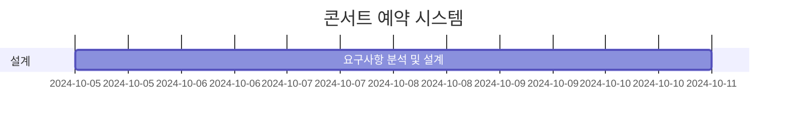

# 01. 마일스톤

## [1주차] 요구사항 분석 및 프로젝트 설계

- 프로젝트 요구사항 분석 및 시퀀스 다이어그램 작성
- 데이터베이스 스키마 설계
- ERD 작성
- API 명세서 작성
- 프로젝트 기본 패키지 구조 작성
- 서버 config 작성
- Mock Api 작성

## gantt

```mermaid
gantt
    title 콘서트 예약 시스템
    dateFormat  YYYY-MM-DD

    section 설계
        요구사항 분석 및 설계: 2024-10-05, 2024-10-11
```
