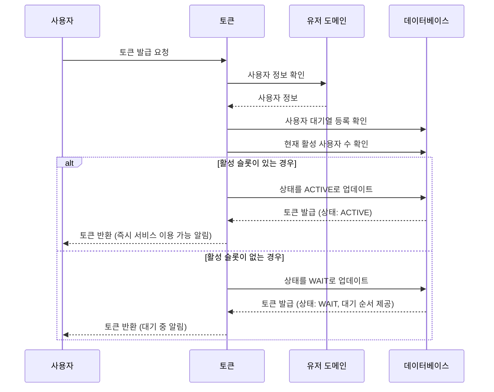
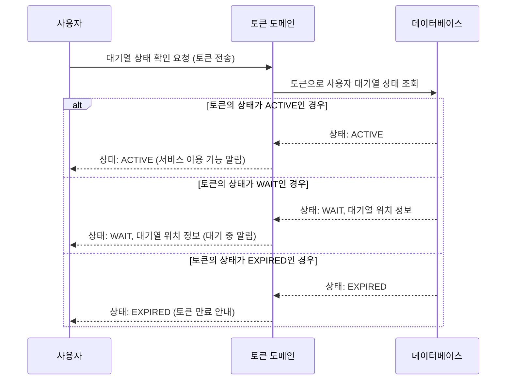
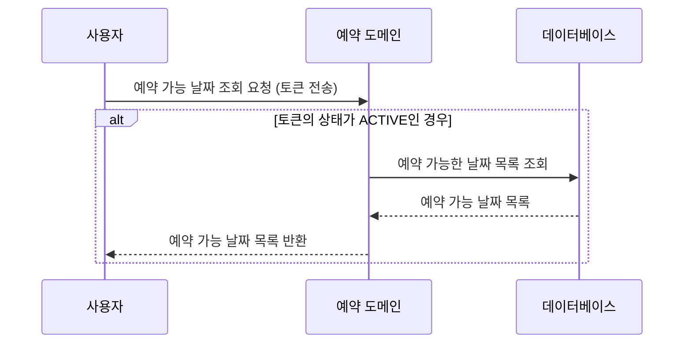
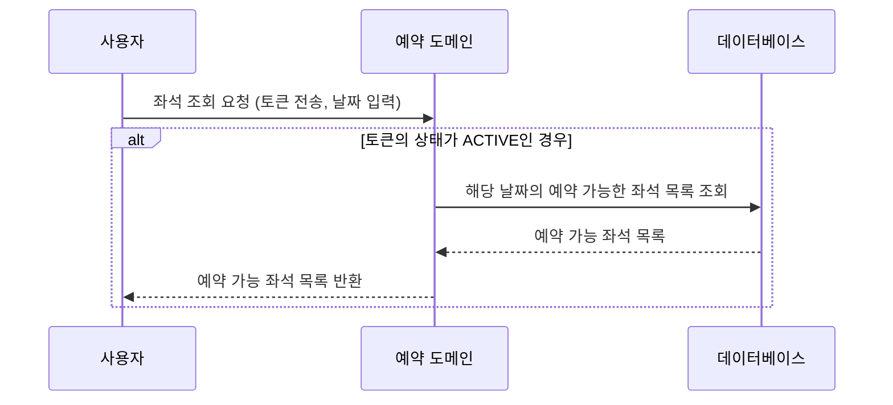
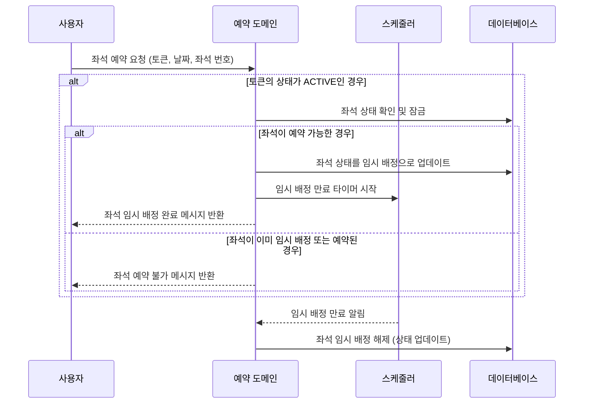
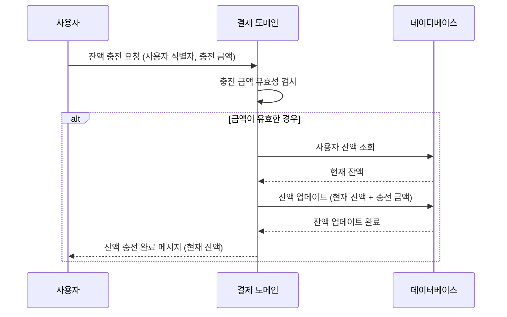
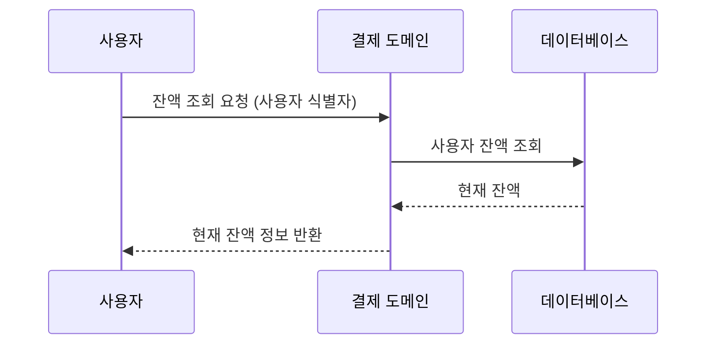
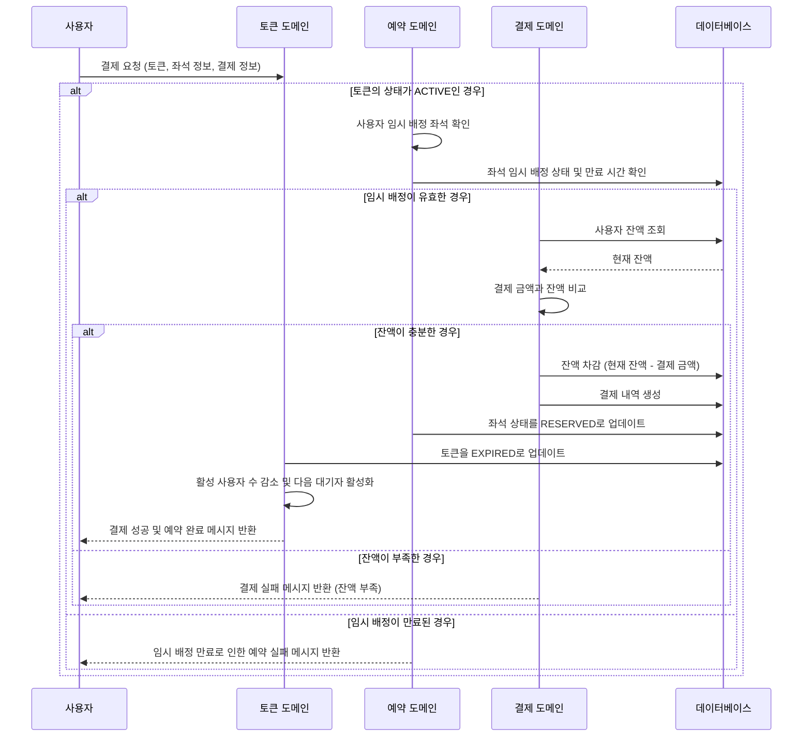

# 콘서트 예약 서비스 유즈케이스

## 1. 유저 토큰 발급 
1. 사용자는 토큰 발급 API를 호출합니다.
2. 토큰 도메인은 유저 도메인을 통해 사용자의 정보를 확인 합니다.
3. 토큰 도메인은 데이터베이스에 사용자 정보로 대기열 등록 여부 확인 합니다.
4. 토큰 도메인은 현재 활성 사용자 수를 확인합니다.
   - 활성 사용자 수가 최대치보다 적으면:
     - 사용자의 상태를 ACTIVE로 설정하고 즉시 서비스 이용이 가능하도록 합니다.
   - 활성 사용자 수가 최대치에 도달하면:
     - 사용자의 상태를 WAIT로 설정하고 대기열에 등록합니다.
5. 토큰 도메인은 토큰을 사용자에게 반환합니다.

## 2. 대기열 상태 확인
1. 사용자는 대기열 상태 확인 API를 호출합니다.
2. 토큰 도메인은 토큰을 통해 사용자 대기열 정보를 확인합니다.
3. 토큰 도메인은 데이터베이스에서 토큰의 대기열 상태를 조회합니다.
4. 토큰 도메인은 사용자의 현재 상태(예: WAIT, ACTIVE, EXPIRED)와 대기열 정보를 사용자에게 반환합니다.

## 3. 예약 가능 날짜 조회
1. 사용자는 예약 가능한 날짜 목록을 조회하기 위해 예약 가능 날짜 조회 API를 호출합니다.
2. 예약 도메인은 데이터베이스에서 예약 가능한 날짜 목록을 조회합니다.
3. 예약 도메인은 예약 가능한 날짜 목록을 사용자에게 반환합니다.

## 4. 특정 날짜 좌석 조회
1. 사용자는 특정 날짜를 선택하고, 해당 날짜의 예약 가능한 좌석을 조회하기 위해 좌석 조회 API를 호출합니다.
2. 예약 도메인은 데이터베이스에서 해당 날짜의 예약 가능한 좌석 목록을 조회합니다.
3. 예약 도메인은 예약 가능한 좌석 목록을 사용자에게 반환합니다.

## 5. 좌석 예약 요청
1. 사용자는 원하는 날짜와 좌석 번호를 선택하여 좌석 예약 요청 API를 호출합니다.
2. 예약 도메인은 요청받은 날짜와 좌석 번호의 현재 상태를 확인합니다.
   - 좌석이 예약 가능하고 임시 배정되지 않은 상태라면
     - 좌석을 사용자에게 임시 배정합니다.
     - 임시 배정 시간은 정책에 따라 설정된 시간(예: 5분)으로 설정됩니다.
     - 스케줄러를 통해 임시 배정 만료 시간을 관리합니다.
   - 좌석이 이미 임시 배정되었거나 예약된 상태라면
     - 예약 불가 메시지를 반환하고 프로세스를 종료합니다.
3. 스케줄러는 임시 배정 시간이 만료되면 해당 좌석의 임시 배정을 해제합니다.

## 6. 잔액 충전
1. 사용자는 잔액을 충전하기 위해 잔액 충전 API를 호출합니다.
2. 결제 도메인은 충전할 금액에 대한 유효성을 검사합니다.
3. 데이터베이스에서 사용자의 현재 잔액을 조회합니다.
4. 잔액에 충전할 금액을 더하여 업데이트합니다.
5. 결제 도메인은 잔액 충전 완료 메시지를 사용자에게 반환합니다.

## 7. 잔액 조회
1. 사용자는 자신의 잔액을 확인하기 위해 잔액 조회 API를 호출합니다.
2. 결제 도메인은 데이터베이스에서 사용자의 현재 잔액을 조회합니다.
3. 결제 도메인은 현재 잔액 정보를 사용자에게 반환합니다.

## 8. 결제 및 예약 확정
1. 사용자는 임시 배정된 좌석에 대해 결제 API를 호출하여 결제를 진행합니다.
2. 토큰 도메인은 사용자의 상태가 ACTIVE인지 확인합니다.
3. 예약 도메인은 사용자가 임시 배정받은 좌석인지 확인합니다.
    - 임시 배정 시간이 유효한지 확인합니다.
4. 결제 도메인은 사용자의 잔액을 확인하고, 결제할 금액이 충분한지 검사합니다.
5. 결제 도메인은 결제 처리를 진행하고, 결제 내역을 생성합니다.
6. 예약 도메인은 해당 좌석의 소유권을 사용자에게 최종 배정합니다.
7. 토큰 도메인은 사용자의 대기열 토큰을 만료(EXPIRED) 상태로 변경합니다.
8. 토큰 도메인은 활성 사용자 수를 감소시키고, 대기열에서 다음 대기자를 활성화합니다.
9. 결제 도메인은 결제 완료 메시지를 사용자에게 반환합니다.
