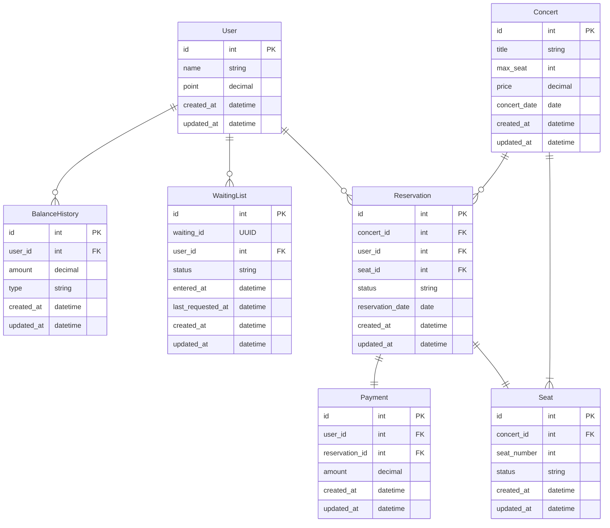

```mermaid
erDiagram
    User {
        id int PK
        name string
        point decimal 
        created_at datetime
        updated_at datetime 
    }

    BalanceHistory {
        id int PK
        user_id int FK
        amount decimal
        type string
        created_at datetime
        updated_at datetime
    }

    WaitingList {
        id int PK
        waiting_id UUID
        user_id int FK
        status string
        entered_at datetime
        last_requested_at datetime
        created_at datetime
        updated_at datetime
    }

    Concert {
        id int PK
        title string
        max_seat int
        price decimal
        concert_date date
        created_at datetime
        updated_at datetime
    }

    Reservation {
        id int PK
        concert_id int FK
        user_id int FK
        seat_id int FK
        status string
        reservation_date date
        created_at datetime
        updated_at datetime
    }

    Seat {
        id int PK
        concert_id int FK
        seat_number int
        status string
        created_at datetime
        updated_at datetime
    }

    Payment {
        id int PK
        user_id int FK
        reservation_id int FK
        amount decimal
        created_at datetime
        updated_at datetime
    }


    User ||--o{ BalanceHistory : ""
    User ||--o{ WaitingList : ""
    User ||--o{ Reservation : ""

    Reservation ||--|| Payment : ""
    Concert ||--o{ Reservation : ""
    Concert ||--|{ Seat : ""
    Reservation ||--|| Seat : ""

```
